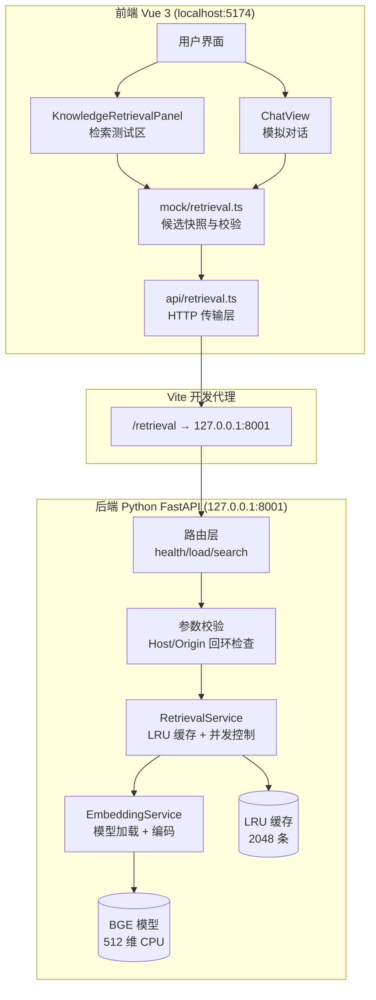
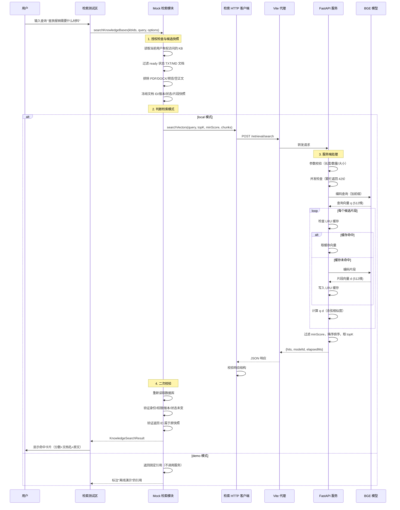
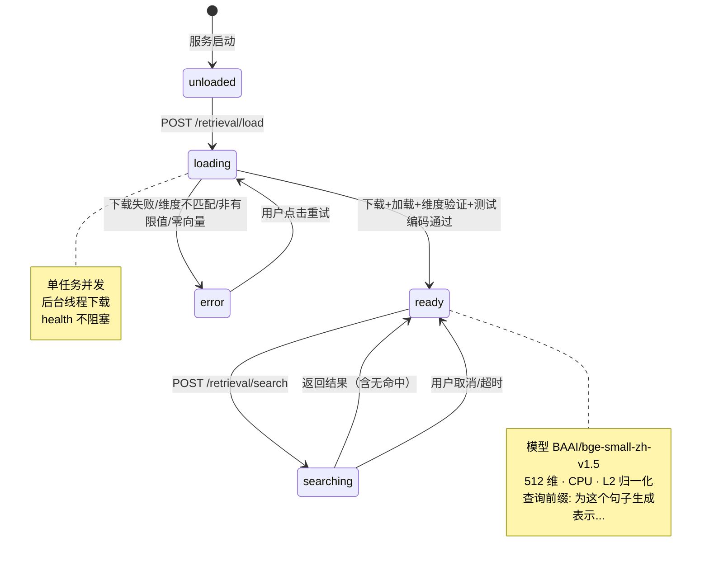
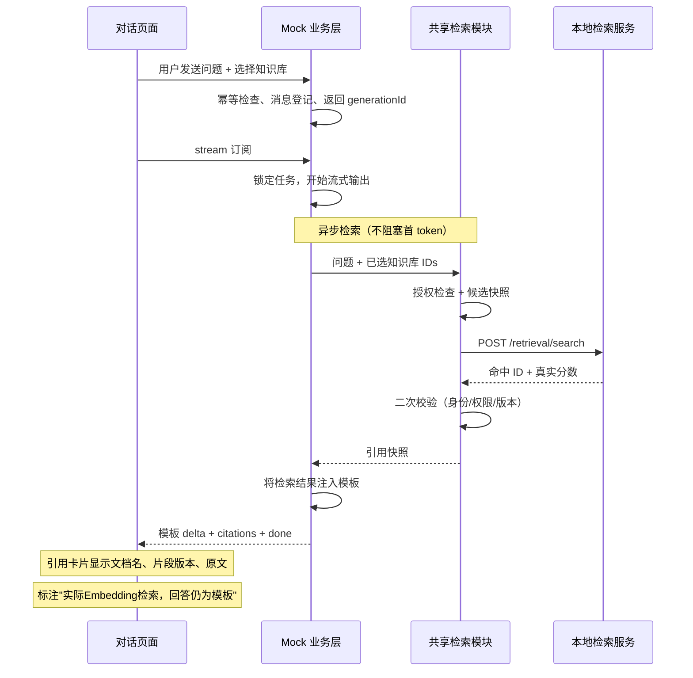
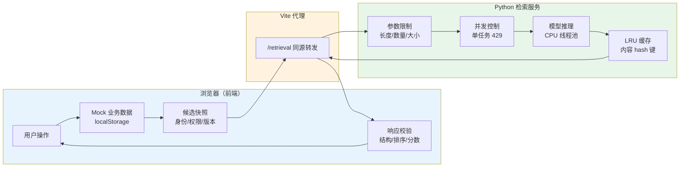

# Embedding 模型工作原理与检索闭环归档

> 本文档归档 HuggingFace BGE 中文 Embedding 模型的集成实施，介绍 Embedding 模型工作原理，并结合本项目展示完整检索闭环。

## 1. 本次改动归档

### 1.1 新增文件

| 文件 | 职责 |
|---|---|
| `backend/app/config.py` | 检索服务配置（模型 ID、维度、查询前缀、资源上限） |
| `backend/app/schemas.py` | Pydantic v2 DTO（请求/响应模型与字段校验） |
| `backend/app/embedding.py` | 模型生命周期管理：lazy load、token 窗口切分、CLS 池化、L2 归一化 |
| `backend/app/retrieval.py` | LRU 向量缓存（2048 条）、余弦相似度聚合、单任务并发控制 |
| `backend/app/main.py` | FastAPI 路由（health/load/search）、Host/Origin 回环校验 |
| `backend/run.py` | 服务启动入口（`127.0.0.1:8001`） |
| `backend/tests/test_retrieval.py` | 20 项 pytest 单测（fake encoder，不联网） |
| `backend/requirements.txt` | 运行依赖 |
| `backend/requirements-dev.txt` | 测试依赖 |
| `backend/.env.example` | 模型来源配置说明 |
| `frontend/src/types/retrieval.ts` | 独立检索类型定义（不污染主类型集合） |
| `frontend/src/api/retrieval.ts` | 同源 HTTP 传输层（取消/超时/错误处理、响应校验） |
| `frontend/src/api/retrieval.test.ts` | 48 项检索 API 单测 |
| `frontend/src/mock/retrieval.ts` | 共享检索模块（候选快照、二次校验、依赖注入） |
| `frontend/src/mock/retrieval.test.ts` | 54 项检索模块单测 |
| `frontend/src/components/KnowledgeRetrievalPanel.vue` | 知识库详情页检索测试区组件 |

### 1.2 修改文件

| 文件 | 改动 |
|---|---|
| `frontend/src/mock/index.ts` | read 回调增加 users/models 快照数据；generate/stream 接入共享检索 |
| `frontend/src/mock/index.test.ts` | 49 项旧 Mock 测试显式选择 demo 模式 |
| `frontend/src/views/KnowledgeDetailView.vue` | 挂载 KnowledgeRetrievalPanel 组件 |
| `frontend/src/views/ChatView.vue` | 对话引用接入实际检索结果，标注"本地 BGE 实际检索" |
| `frontend/src/views/KnowledgeView.vue` | 更新能力描述 |
| `frontend/src/views/LoginView.vue` | 更新能力描述 |
| `frontend/vite.config.ts` | 添加 `/retrieval` 代理到 `127.0.0.1:8001` |
| `.gitignore` | 添加 Python 虚拟环境、模型缓存排除 |
| `README.md` | 补充后端目录、检索能力、启动流程、测试数量 |
| `HuggingFace小型Embedding与知识库检索实施方案.md` | 执行记录与实测数据 |

### 1.3 测试统计

| 维度 | 数量 | 状态 |
|---|---|---|
| 前端 Vitest | 248 项 | ✅ 全部通过 |
| 后端 pytest | 20 项 | ✅ 全部通过 |
| vue-tsc 类型检查 | — | ✅ 通过 |
| vite build | — | ✅ 通过 |

### 1.4 实测数据

- **模型**: BAAI/bge-small-zh-v1.5（revision `7999e1d3`，Apache-2.0）
- **维度**: 512，max_seq_length: 512
- **查询**: "差旅报销需要什么材料？"
- **结果**: c2（差旅相关）score=0.7507 Top1，c1（会议室）score=0.3007，c3（数据库）被 minScore=0.3 过滤
- **耗时**: ≈56ms（3 个候选片段，CPU 推理）

### 1.5 浏览器端到端验证

| 步骤 | 状态 | 证据 |
|---|---|---|
| 模型健康检测 | ✅ | "模型就绪" — BAAI/bge-small-zh-v1.5, 512维, CPU |
| 基础检索 | ✅ | 查询"差旅报销需要什么材料" → 命中1条 score=0.7203 |
| 上传+检索 | ✅ | 上传 TXT 后查询"出差报销审批" → 命中2条（0.6931, 0.6590） |
| 模拟对话引用 | ✅ | 回复包含3条引用卡片，标注"本地BGE实际检索" |

---

## 2. Embedding 模型工作原理

### 2.1 什么是 Embedding

Embedding（嵌入）是将离散符号（文字、词、句子）映射为连续向量空间中的稠密向量的过程。每个向量是一个固定维度的浮点数数组，语义相近的内容在向量空间中距离更近。

```
"差旅报销" → [0.12, -0.34, 0.56, ..., 0.78]  ← 512 维向量
"出差费用" → [0.11, -0.33, 0.55, ..., 0.77]  ← 语义相近，向量接近
"数据库备份" → [-0.45, 0.67, -0.12, ..., 0.03] ← 语义无关，向量远离
```

### 2.2 BGE 模型架构

本项目使用 `BAAI/bge-small-zh-v1.5`（北京智源人工智能研究院），架构如下：

```
输入文本
  │
  ▼
─────────────────────────┐
│  Tokenizer（分词器）      │  将文本切分为 token ID 序列
│  "为这个句子生成表示..."   │  查询添加前缀，文档不添加
└────────────┬────────────┘
             │
             ▼
┌─────────────────────────
│  BERT Encoder（12层）     │  双向 Transformer 编码器
│  自注意力 + 前馈网络       │  捕获上下文语义关系
└────────────┬────────────┘
             │
             ▼
┌─────────────────────────┐
│  CLS Pooling（池化）      │  取 [CLS] token 的输出向量
│  作为整句表示              │  512 维原始向量
└────────────┬────────────┘
             │
             ▼
┌─────────────────────────┐
│  L2 归一化               │  向量长度归一为 1
│  ‖v‖ = 1                │  点积 = 余弦相似度
└────────────┬────────────
             │
             ▼
        512 维单位向量
```

### 2.3 查询前缀机制

BGE 模型采用**非对称检索**设计：查询和文档使用不同的输入格式。

- **查询输入**: `为这个句子生成表示以用于检索相关文章：` + 用户问题
- **文档输入**: 原始文档片段（不加前缀）

这个前缀在模型预训练时学习，引导编码器为查询生成更适合检索的表示。不加前缀的查询向量与文档向量的相似度会显著降低。

### 2.4 相似度计算

经过 L2 归一化后，两个向量的**点积**等于它们的**余弦相似度**：

$$\text{similarity}(q, d) = \frac{q \cdot d}{\|q\| \times \|d\|} = q \cdot d \quad (\text{当 } \|q\| = \|d\| = 1)$$

- 相似度范围：[-1, 1]
- 1.0 = 完全相同方向（语义完全一致）
- 0.0 = 正交（语义无关）
- -1.0 = 完全相反方向

本项目默认阈值 minScore=0.3，过滤掉语义不相关的候选。

### 2.5 长文本窗口切分

模型最大输入长度为 512 tokens（约 300-400 个中文字符）。超过此长度的文本需要切分：

```
长文档: [token_1, token_2, ..., token_600]
         ├──── 窗口1 (510 tokens) ────┤
                    ├──── 窗口2 (510 tokens, overlap=32) ───┤
                                         ├──── 窗口3 ────┤

每个窗口独立编码 → 取所有窗口向量的平均 → L2 归一化
```

窗口重叠 32 tokens 确保边界内容不被截断丢失。

---

## 3. 项目整体架构与工作流程

### 3.1 系统架构总览



### 3.2 完整检索闭环流程



### 3.3 模型加载与状态机



### 3.4 模拟对话引用流程



### 3.5 数据流与责任边界



**责任边界**：
- **前端**：管理用户、知识库、文档、会话等业务数据；负责授权检查、候选快照、响应校验
- **检索服务**：只接收查询和候选正文，不存业务记录，不访问数据库，不接收 API Key
- **代理层**：同源转发，不修改请求内容
- **检索服务仅绑定回环地址**，不向局域网暴露

---

## 4. 关键技术决策

| 决策 | 选择 | 理由 |
|---|---|---|
| 模型 | BAAI/bge-small-zh-v1.5 | 中文检索专用，512 维轻量，Apache-2.0 |
| 推理框架 | SentenceTransformers + CPU PyTorch | 生态成熟，CPU 推理足够测试场景 |
| 查询前缀 | `为这个句子生成表示以用于检索相关文章：` | BGE 官方推荐，非对称检索设计 |
| 相似度 | 归一化点积 = 余弦相似度 | L2 归一化后等价，计算高效 |
| 长文本 | Token 窗口切分（overlap=32） | 避免截断，保留边界上下文 |
| 缓存 | LRU 2048 条，内容 hash 键 | 有界内存，不持久化，重启清除 |
| 并发 | 单任务，繁忙 429 | CPU 推理资源有限，避免排队堆积 |
| 模式 | local/demo 双模式 | local 实际检索，demo 离线演示 |
| 校验 | 快照二次校验 | 防止检索期间数据变化导致不一致 |

---

## 5. 文件结构

```
模型管理系统/
├── README.md
├── HuggingFace小型Embedding与知识库检索实施方案.md    # 专项实施文档
── Embedding模型工作原理与检索闭环归档.md              # 本文档
├── .gitignore
├── backend/                                            # Python 本地检索服务
│   ├── app/
│   │   ├── config.py          # 配置（模型、维度、限制）
│   │   ├── schemas.py         # Pydantic DTO
│   │   ├── embedding.py       # 模型生命周期与编码
│   │   ├── retrieval.py       # LRU 缓存与检索
│   │   └── main.py            # FastAPI 路由
│   ├── tests/test_retrieval.py  # 20 项单测
│   ├── run.py                   # 启动入口
│   ├── requirements.txt
│   └── requirements-dev.txt
└── frontend/                                           # Vue 3 前端
    ├── vite.config.ts            # /retrieval 代理配置
    └── src/
        ├── types/retrieval.ts    # 检索类型定义
        ├── api/retrieval.ts      # HTTP 传输层
        ├── api/retrieval.test.ts # 48 项 API 测试
        ├── mock/retrieval.ts     # 共享检索模块
        ├── mock/retrieval.test.ts # 54 项模块测试
        ── components/
            └── KnowledgeRetrievalPanel.vue  # 检索测试区
```

---

## 6. 启动命令

```powershell
# 前端
npm --prefix ./frontend run dev          # http://localhost:5174

# 后端检索服务
python -m venv ./backend/.venv
& ./backend/.venv/Scripts/python.exe -m pip install -r ./backend/requirements.txt
& ./backend/.venv/Scripts/python.exe ./backend/run.py   # http://127.0.0.1:8001

# 测试
npm --prefix ./frontend test             # 248 项前端测试
& ./backend/.venv/Scripts/python.exe -m pytest ./backend/tests  # 20 项后端测试
```
