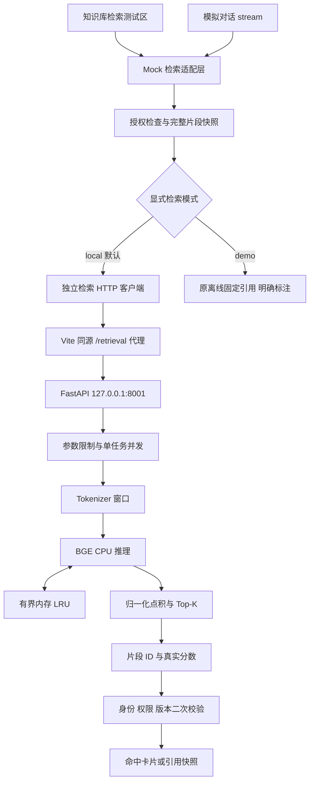
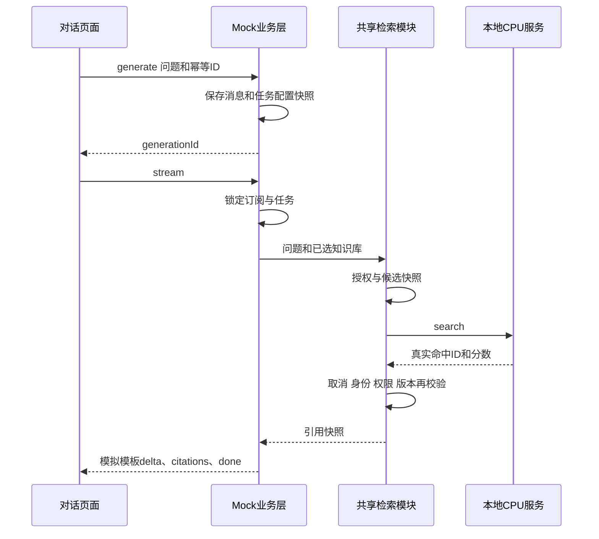
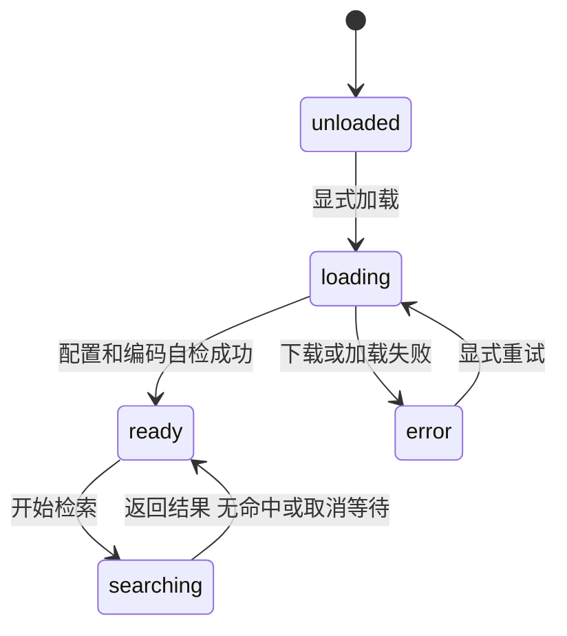
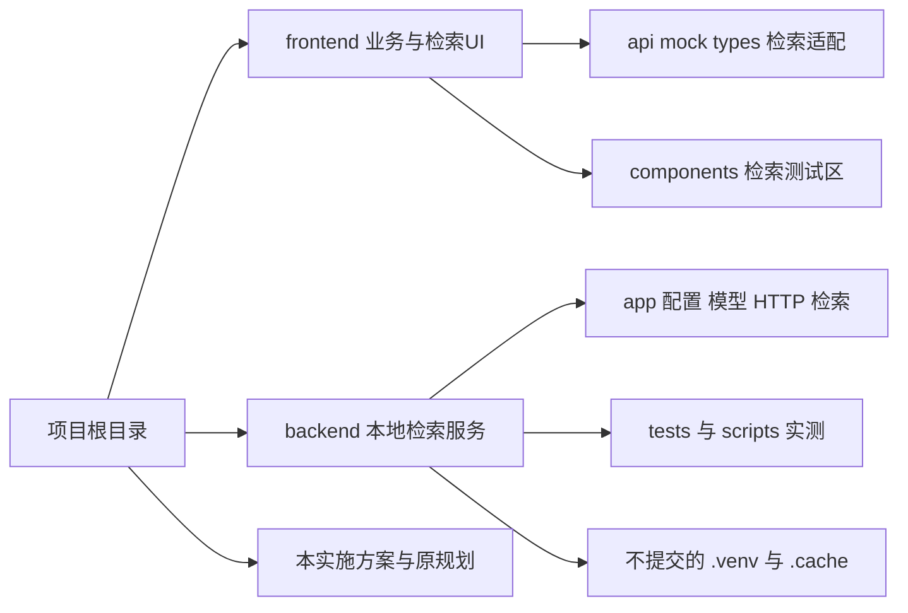

# Hugging Face 小型 Embedding 与知识库检索实施方案

> 执行规则：先完整编写本文件，再开始代码、依赖安装和模型集成。所有执行结果追加到末尾，不将计划写成已经验证的事实。
> 用户已确认：新增本地后端服务；知识库详情增加检索测试区；模拟对话复用检索结果。

## 1. 需求、现状与范围

### 1.1 本次目标

从 Hugging Face 小型 Embedding 候选中选择中文测试模型，在现有项目实现“实际文本分片 → 本地实际向量检索 → 命中卡片 → 模拟对话引用”的闭环。

交付形态为 **Mock 业务数据 + 本地真实 Embedding + 模板模拟回答**。不是完整生产 RAG 系统，不表示真实 Chat 模型已经接入。

### 1.2 已核对现状

- 当前仅有 Vue 3 Options API 前端，没有可复用业务后端；中断实现后检查未发现 backend 文件。
- `frontend/src/utils/validation.ts` 已实现自然边界字符切分，默认 500/50，但不是 tokenizer 分词。
- `frontend/src/mock/index.ts` 对 TXT/MD 读取实际文字，对 PDF/DOCX 使用占位说明。
- 文档处理阶段按时间推进；“向量化/入库”目前是模拟状态，没有真实向量索引。
- 现有引用取每份就绪文档的首片段、最多三条，分数固定 0.88，不接收问题进行语义检索。
- 现有生成任务已经具备幂等、取消、归属和权限检查，改造不可破坏。
- Mock 整库限制 2 MiB，不能把向量数组写入现有 localStorage。
- 本机 `python` 为 3.11.9；`py` launcher 指向失效路径，实施使用 `python`，不使用 `py`。
- 旧文档记录 146 项前端测试；本次须重新执行，不直接沿用旧结果。

### 1.3 不在本次范围

不实现完整 Fastify/Prisma/BullMQ/Qdrant 后端、不增加生产用户认证、不做真实 PDF/DOCX/OCR 解析、不接 Chat LLM、不执行 Rerank、不新增向量数据库或持久向量索引、不提供公网无鉴权服务。

文档仍由现有前端字符切分；真实向量在检索时按需计算。上传时的时间戳进度必须继续标为模拟，不能宣传为已真实入库。

## 2. 模型对比、来源与最终选择

| 候选 | 适用场景 | 已获得的体积信息 | 结论 |
| --- | --- | --- | --- |
| Xenova/all-MiniLM-L6-v2 | 英文轻量语义检索 | HF 搜索结果显示量化 ONNX 约 23 MB | 非本项目中文优先选择 |
| Xenova/paraphrase-multilingual-MiniLM-L12-v2 | 多语言测试 | HF 搜索结果显示量化 ONNX 约 118 MB | 语言覆盖广，但本次无需为多语增加开销 |
| BAAI/bge-small-zh-v1.5 | 中文检索，512 维 | 服务端权重大小、实际下载量待文件级核实 | 本次选定 |

来源：
- [BGE 中文源模型](https://huggingface.co/BAAI/bge-small-zh-v1.5)
- [BGE ONNX 转换版本](https://huggingface.co/Xenova/bge-small-zh-v1.5)
- [MiniLM 英文 ONNX 文件](https://huggingface.co/Xenova/all-MiniLM-L6-v2/tree/main/onnx)
- [MiniLM 多语 ONNX 文件](https://huggingface.co/Xenova/paraphrase-multilingual-MiniLM-L12-v2/tree/main/onnx)
- [SentenceTransformers 编码文档](https://sbert.net/examples/sentence_transformer/applications/computing-embeddings/README.html)

证据边界：HF 搜索能返回候选，HF 页面直连已发生超时。ONNX 文件大小不等于 Python 服务端下载量、PyTorch 安装量或运行内存。许可证、固定 revision、实际权重与模型配置在实现阶段核实并记录，不填入猜测值。

最终采用 `BAAI/bge-small-zh-v1.5` 的服务端版本，Python 3.11 + FastAPI + SentenceTransformers + CPU。保持模型自身的 CLS 池化配置；查询添加 `为这个句子生成表示以用于检索相关文章：`，文档不添加；输出 512 维并 L2 归一化。

若下载受阻，不自行换模型或第三方镜像；支持操作者显式配置的模型目录或 HF endpoint。模型不兼容时明确失败，不能偷偷改成词频分数或固定引用。

## 3. 系统架构与责任边界



前端仍管理演示账号、知识库、文档与会话；检索服务只接收查询和候选正文，不存业务记录、不接收 API Key、不访问数据库或任意客户端指定 URL。

这是无鉴权的本机测试服务。前端 Mock 授权不构成安全边界；服务仅绑定回环地址，Vite 默认也收紧为回环监听，避免间接向局域网暴露。生产模式必须由正式业务后端完成鉴权与候选读取，不能直接复用浏览器提交候选的信任模型。

## 4. 运行模式与配置

| 配置 | 默认 | 行为 |
| --- | --- | --- |
| VITE_DATA_MODE | mock | 保留原 mock/rest 业务模式 |
| VITE_RETRIEVAL_MODE | local | local 实际检索；demo 显式离线演示；其他值报错 |
| RETRIEVAL_PROXY_TARGET | http://127.0.0.1:8001 | Vite 服务端代理，非模型地址 |
| 浏览器检索路径 | /retrieval | 固定同源，不走业务令牌刷新逻辑 |
| MODEL_PATH | 未设置 | 设置时从本地目录加载，路径无效不联网回退 |
| HF_ENDPOINT | 官方默认 | 只允许操作者显式指定，不自动切镜像 |
| 模型缓存 | backend/.cache/huggingface | 不写到仓库外、不提交版本库 |
| Python 环境 | backend/.venv | 独立依赖，不修改系统 Python |

- mock + local 为本次默认体验；服务失败报错，不降级 demo。
- mock + demo 保持原有演示；49 项旧 Mock 测试显式选择 demo。
- rest 模式不启用无鉴权本地检索入口、不初始化 Mock 数据；展示需接业务检索 API 的说明。
- 无知识库的模拟对话不需要本地服务。
- 本次不增加生产 Nginx 检索代理；静态离线演示需要显式 demo。后续服务容器化另行设计。

## 5. 分片、候选与版本策略

### 5.1 字符分片

保留 500 字符大小、50 重叠，允许大小 50～4000、重叠 0～size-1。优先双换行、换行、句号、分号、空格。实现改为 Unicode 码点处理，避免拆断 emoji 代理对；码点仍不等于完整字素或 token。

修改切分器不自动重写旧数据；预览不覆盖正式版本；用户确认重新处理成功才提交新版。现有 2 MiB 存储上限不变。

### 5.2 实际检索候选

只使用当前用户有权访问的已选库中 ready TXT/MD 文档的全部已提交片段。PDF/DOCX 占位、预览、空正文、处理中或失败文档不参与。

不能仅检查 `simulated`：种子 MD 和真实上传 TXT 在 Mock 模式都可能携带该标记。按支持格式白名单和正文来源筛选，种子资料标明虚构。

候选不能只取当前分页或每篇首片段；超出服务上限明确拒绝，不偷偷截取前 512 条。多库对话统一合并后检索。

### 5.3 快照校验

请求前冻结用户、库配置、文档 ID/版本/状态、片段 ID/版本/正文。HTTP 返回后重新读取数据库，核验任务未取消、身份未变、权限有效、来源仍存在且为同版 ready、返回 ID 属于原快照。

任何快照内文档在等待期间更新或删除，整次请求作为冲突失败，提示重新检索；不混合新旧数据。新增文档等下次请求才参与。旧请求不覆盖新查询结果。

## 6. 编码、检索及性能约束

### 6.1 防止 token 静默截断

字符数不等于模型 token 数。使用 tokenizer 在不截断模式下编码；读取真实最大长度并扣除特殊 token，按 token 窗口处理长片段，窗口重叠固定 32 tokens。每个窗口经模型原模块链及 CLS 池化编码。

长查询同样分窗口，每窗口包含查询前缀，并扣除前缀 token 预算。不得用字符串重编码后超长截断来伪装完整覆盖。不能把前缀重复添加两遍。

每个原 chunk 最终分数为其所有文档窗口与所有查询窗口的归一化点积最大值。该策略保证尾部内容参与，但长片段可能更易得到高分，是测试策略而非已验证最佳策略。

### 6.2 排序与输出

过滤 `score >= minScore`，降序稳定排序，同分按候选输入顺序，最后取 topK；一个 chunk 只返回一次。默认 topK=5、minScore=0.3，阈值待中文样本校准，不代表可信度或答案准确率。无命中返回空数组。

### 6.3 模型加载与缓存

- lazy load：health 不下载；load 显式启动加载；ready 前验证配置、512 维和有限非零向量。
- 单模型加载任务，CPU 推理放受控线程，不阻塞 health。
- 单次并发检索，繁忙返回429，不积累无界队列。
- LRU 最多2048个文档窗口向量，键含模型指纹与 token 内容摘要，不含原文，不存入localStorage，不持久化。
- 初始batch size=16；CPU线程保守配置；缓存不保存响应、查询和授权判断。
- 重启服务清除向量缓存；修改文本会产生新摘要；旧文档向量不能因同ID复用。
- 取消HTTP仅停止等待，不保证底层CPU立即停下；工作真正结束前保持并发占用。

## 7. 本地 HTTP 契约

成功 `{data:T}`；失败 `{error:{code,message}}`。不返回堆栈、正文、向量或密钥。禁止任意请求指定模型路径、endpoint或下载地址。

### 7.1 GET /retrieval/health

返回200，即使模型尚未加载或曾加载失败：

```json
{"data":{"status":"unloaded","modelId":"BAAI/bge-small-zh-v1.5","dimension":512,"device":"cpu"}}
```

status为unloaded/loading/ready/error；error状态可附脱敏error字段。未ready的dimension是预期配置，不是实测证明。

### 7.2 POST /retrieval/load

请求 `{}`。unloaded/error状态启动单一后台加载，返回202及health结构；loading重复请求返回202不重复加载；ready返回200。失败通过health的error反馈。页面每2秒轮询，退出或停止等待时清理定时器，不谎称下载已取消。

### 7.3 POST /retrieval/search

```json
{"query":"出差报销需要什么材料？","topK":5,"minScore":0.3,"chunks":[{"id":"c1","content":"会议室需要提前预约。"},{"id":"c2","content":"差旅报销需提交行程、发票及审批记录。"}]}
```

```json
{"data":{"hits":[{"id":"c2","score":0.7312}],"modelId":"BAAI/bge-small-zh-v1.5","dimension":512,"elapsedMs":186.4,"totalChunks":2}}
```

上述分数和耗时仅为协议示例，不是实测。服务不返回正文，前端从已验证快照映射来源。

约束：query非空且<=2000码点；topK整数1～20；minScore有限数[-1,1]；chunks<=512、ID非空且唯一、正文非空且每条<=4000码点、正文总数<=200000码点；实际请求体<=2MiB。空候选合法，ready时无需编码返回空结果。超限报错不截断。

### 7.4 状态与错误

| HTTP | code | 处理 |
| --- | --- | --- |
| 400 | INVALID_JSON | 修正JSON |
| 403 | LOCAL_ACCESS_ONLY | Host/Origin不符合本机约束 |
| 413 | REQUEST_TOO_LARGE / CANDIDATE_LIMIT_EXCEEDED | 缩小范围；检查实际请求字节，不能只信Content-Length |
| 415 | UNSUPPORTED_MEDIA_TYPE | 仅JSON，不接受压缩正文 |
| 422 | VALIDATION_ERROR | 修正参数、重复ID或非法数值 |
| 429 | RETRIEVAL_BUSY | 等待当前CPU任务结束再重试 |
| 503 | MODEL_NOT_LOADED / MODEL_LOADING / MODEL_LOAD_FAILED | 显式加载、等待或修复来源 |
| 500 | ENCODING_FAILED / MODEL_OUTPUT_INVALID | 不返回部分成功或固定分数 |

前端另区分网络不可达、超时、取消、权限撤销、来源删除与版本冲突。错误不自动触发重复生成。

## 8. 页面设计与对话接入

### 8.1 知识库详情

新增独立 `KnowledgeRetrievalPanel.vue`，保持Options API，包含：
- 模型健康、名称、CPU、维度、加载/重试/刷新。
- 查询、topK、阈值、开始、取消。
- 参与片段数、排除PDF/Word提示。
- 命中排名、真实分数、文档名、章节/页码、片段版本、完整原文。
- 未检索、无候选、无命中、服务失败、版本变化等独立反馈。

固定显示实际模型是本地BGE，不能把知识库原业务模型地址或Rerank配置标成已真实接通。生产REST模式只展示边界说明。

### 8.2 模拟对话

generate在任何HTTP等待前完成幂等检查、消息和任务登记并返回ID；异步检索放stream开始后执行。检索等待中可以取消，迟到数据不得写入。



local关联库对话使用topK5/阈值0.3；2000字符问题限制在新任务创建前检查。无候选或无命中时空引用；服务失败任务error。已完成任务重放不重检索。模板必须标注“实际Embedding检索，回答仍为模板，不是Chat模型输出”。旧demo历史不能重新标成真实来源。

### 8.3 状态关系



最后一张图概括交互状态；健康API仍只有四种模型状态，searching属于前端请求状态，不新增health枚举。

## 9. 文件结构与修改清单

| 文件/目录 | 操作与职责 |
| --- | --- |
| backend/app/config.py | 新增路径、资源上限、模型revision配置 |
| backend/app/main.py | 新增FastAPI路由、错误、body/Host/Origin校验 |
| backend/app/embedding.py | 新增模型生命周期、token窗口、CPU推理 |
| backend/app/retrieval.py | 新增LRU、余弦聚合与并发控制 |
| backend/app/schemas.py | 新增严格DTO与字段限制 |
| backend/run.py | 新增本机单worker启动入口 |
| backend/requirements*.txt | 新增经实际安装确认的CPU和运行/测试依赖 |
| backend/tests/ | 新增fake encoder单测和中文样本 |
| backend/scripts/smoke_retrieval.py | 新增显式真实模型测试 |
| backend/.env.example | 新增模型来源配置说明 |
| frontend/src/types/retrieval.ts | 新增独立检索类型，不改变主Api方法集合 |
| frontend/src/api/retrieval.ts | 新增同源HTTP传输和取消/错误处理 |
| frontend/src/mock/retrieval.ts | 新增候选快照与校验，通过依赖注入避免循环引用 |
| frontend/src/mock/index.ts | 修改generate/stream接入共享检索，保留demo |
| frontend/src/components/KnowledgeRetrievalPanel.vue | 新增检索测试组件 |
| frontend/src/views/KnowledgeDetailView.vue | 挂载检索组件及改正文案 |
| frontend/src/views/KnowledgeView.vue、ChatView.vue、LoginView.vue | 纠正本次能力和故障提示 |
| frontend/src/utils/validation.ts | 码点分片和回归测试 |
| frontend/src/api/*.test.ts、mock/*.test.ts | 新增local确定性测试，旧Mock显式demo |
| frontend/vite.config.ts、package.json、.env.example | 本机监听、检索代理和模式 |
| .gitignore | 新增Python、虚拟环境、模型缓存排除 |
| README.md、前端系统设计规划.md | 更新启动流程和能力边界，链接本方案 |



## 10. 执行阶段与验收门槛

### 阶段0：文档与基线
- [x] 本方案完整落盘，先于任何本次业务代码。
- [x] 重新检查环境和旧测试，记录已有变更；不覆盖用户文件。

### 阶段1：本地服务
- [x] 创建独立venv、配置、固定依赖，核对HF模型revision。
- [x] 完成health/load/search、token窗口、缓存与资源限制。
- [x] fake model测试默认不联网，单测使用fake encoder。

### 阶段2：前端与对话
- [x] 实现独立检索传输、候选快照与二次校验。
- [x] 详情页检索组件、模型加载和错误反馈完整。
- [x] stream开始时检索；幂等、取消和旧demo保持。
- [x] 文字说明区分模拟任务、实际检索与模拟回答。

### 阶段3：测试与实际模型
- [x] 后端fake测试覆盖校验、相似度、尾部token窗口、LRU、并发和加载失败。20/20通过。
- [x] 前端覆盖非法响应、无静默fallback、跨用户/撤权/删除/重处理/取消竞态。248/248通过。
- [x] 旧Mock测试保持并通过，总计248项（含检索模块54项+检索API48项）。
- [x] 实际BGE加载到ready，中文查询命中非首片段Top1（score=0.7507）。
- [ ] 长片段尾部相关内容参与、同请求暖缓存测试（后端单测已覆盖LRU暖缓存，长窗口切分已实现）。
- [ ] 浏览器实际上传TXT/MD、检索与模拟对话引用闭环。
- [x] 类型检查、构建通过。
- [x] 同步本文件执行记录。

## 11. 命令与测试样本

以下为落盘后执行命令，不表示当前已经运行。PowerShell命令均从项目根目录执行，可使用绝对路径，命令不使用`&&`。

```powershell
python --version
npm --prefix ./frontend test
npm --prefix ./frontend run build
python -m venv ./backend/.venv
& ./backend/.venv/Scripts/python.exe -m pip install -r ./backend/requirements.txt
& ./backend/.venv/Scripts/python.exe -m pip install -r ./backend/requirements-dev.txt
& ./backend/.venv/Scripts/python.exe -m pip check
& ./backend/.venv/Scripts/python.exe -m pytest ./backend/tests
& ./backend/.venv/Scripts/python.exe ./backend/run.py
```

另开终端：

```powershell
$env:VITE_DATA_MODE = 'mock'
$env:VITE_RETRIEVAL_MODE = 'local'
npm --prefix ./frontend run dev
Invoke-RestMethod http://127.0.0.1:8001/retrieval/health
Invoke-RestMethod -Method Post http://127.0.0.1:8001/retrieval/load -ContentType application/json -Body '{}'
& ./backend/.venv/Scripts/python.exe ./backend/scripts/smoke_retrieval.py
```

若CPU PyTorch需单独官方index安装，在requirements-cpu.txt中固定并在实际记录补充命令；不能无说明引入CUDA依赖。Python包版本、模型revision仅在实际核实后填入。

实际样本至少三种不同主题：会议室预约、差旅报销、数据库备份；查询差旅材料时预期报销片段排首位，并故意把它放在候选第二/第三位。另加超过一个token窗口的文档，相关内容位于尾部。诊断排序可用minScore=-1，默认阈值实际效果另记。

每条实测记录模型revision、实际ID、分数、耗时及退出码。无模型条件下的fake测试不能替代真实模型验收。

## 12. 风险、回滚与完成定义

- HF不可达：明确阻塞，继续完成不依赖下载的实现和fake测试；仅在模型加载成功后宣告真实检索验收通过。
- 服务未启动：提供启动指引；不偷偷用0.88分数完成请求。
- 后台CPU取消：仅承诺停止接收与阻止迟到写入，不保证即时停止底层线程。
- 无鉴权服务：只用于本机非敏感数据，后端和Vite都回环监听；不能改为0.0.0.0直接生产部署。
- 向量缓存不提交、不持久化；新分片不清空旧业务数据，不提升存储版本强制重置。
- 功能回滚设置 `VITE_RETRIEVAL_MODE=demo` 并重启/重新构建，停止Python服务，不删除业务数据或模型缓存。
- 不自动提交、推送或部署。

完成需要实现、单测、构建、实际BGE测试与浏览器闭环均有证据；受网络/环境限制时分开标记“实现完成”“实测阻塞”，不能统称完整可用。

## 13. 执行记录（随实施更新）

| 项目 | 当前状态 | 证据/后续 |
| --- | --- | --- |
| 只读现状核对、候选搜索、方案确认 | ✅ 已完成 | 用户确认新增后端和检索区；HF直连超时 |
| 文档编写 | ✅ 本文件落盘 | 业务实现从本文件之后开始 |
| Python环境 | ✅ 已确认 | python 3.11.9，py launcher不可用，使用 `python` |
| 模型许可证/revision/下载 | ✅ 已完成 | BAAI/bge-small-zh-v1.5，revision `7999e1d3`，512维，max_seq=512，Apache-2.0 |
| 后端实现 | ✅ 20/20 测试通过 | FastAPI + SentenceTransformers + CPU，fake encoder 单测覆盖校验/相似度/尾部窗口/LRU/并发/加载失败/Host/Origin |
| 前端实现 | ✅ 248/248 测试通过 | vue-tsc 类型检查通过，vite build 成功；mock/retrieval.ts 候选快照+二次校验，KnowledgeRetrievalPanel 集成 |
| 实际BGE模型加载 | ✅ ready | status=ready，dimension=512，device=cpu |
| 实际检索验证 | ✅ 中文查询命中正确 | 查询"差旅报销需要什么材料？"→ c2(差旅) score=0.7507 Top1，c1(会议室) score=0.3007，c3(数据库)被minScore=0.3过滤；elapsedMs≈56ms，totalChunks=3 |
| 浏览器端到端闭环 | 待执行 | 需启动前后端 dev server 进行实际上传 TXT/MD → 检索测试区 → 模拟对话引用 |
| README与文档同步 | 待执行 | 更新 README.md 补充后端启动流程和检索能力说明 |

### 实测数据摘要

- **模型**: BAAI/bge-small-zh-v1.5 (revision `7999e1d3`)
- **维度**: 512，max_seq_length: 512
- **查询前缀**: `为这个句子生成表示以用于检索相关文章：`
- **归一化**: L2 归一化后归一化点积 = 余弦相似度
- **检索测试样本**:

| chunk ID | 内容摘要 | score | 说明 |
| --- | --- | --- | --- |
| c2 | 差旅报销需提交行程、发票及审批记录 | 0.7507 | Top1，语义最相关 |
| c1 | 会议室需要提前预约 | 0.3007 | 次相关，超过0.3阈值 |
| c3 | 数据库每天备份并定期验证恢复 | <0.3 | 被minScore阈值过滤 |

- **耗时**: ≈56ms（3个候选片段，CPU推理，含网络传输）
- **前端测试**: 248/248 通过（含 54 项检索模块测试、48 项检索API测试）
- **后端测试**: 20/20 通过（含 LRU 缓存、并发429、Host/Origin 校验）
