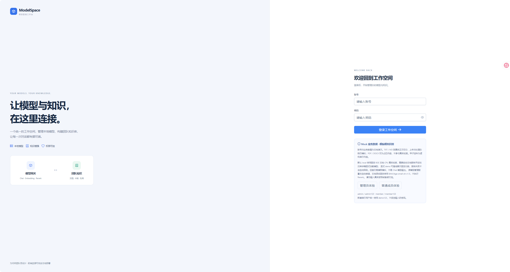
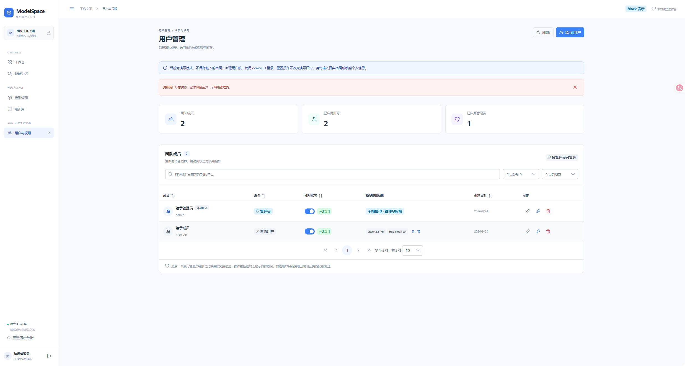
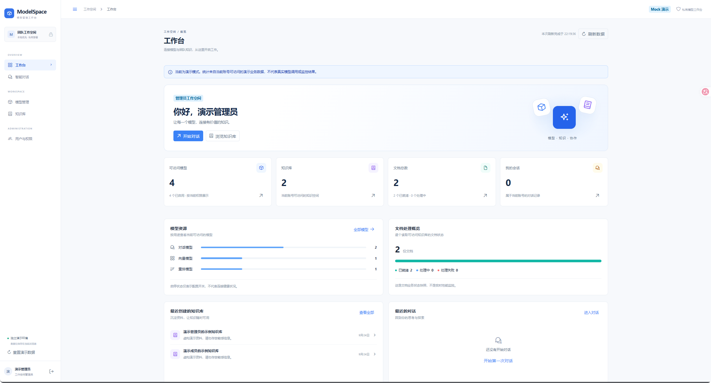
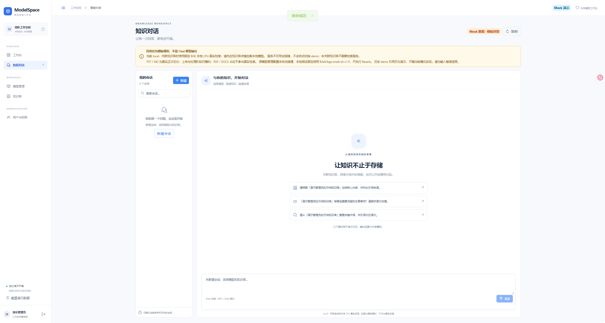
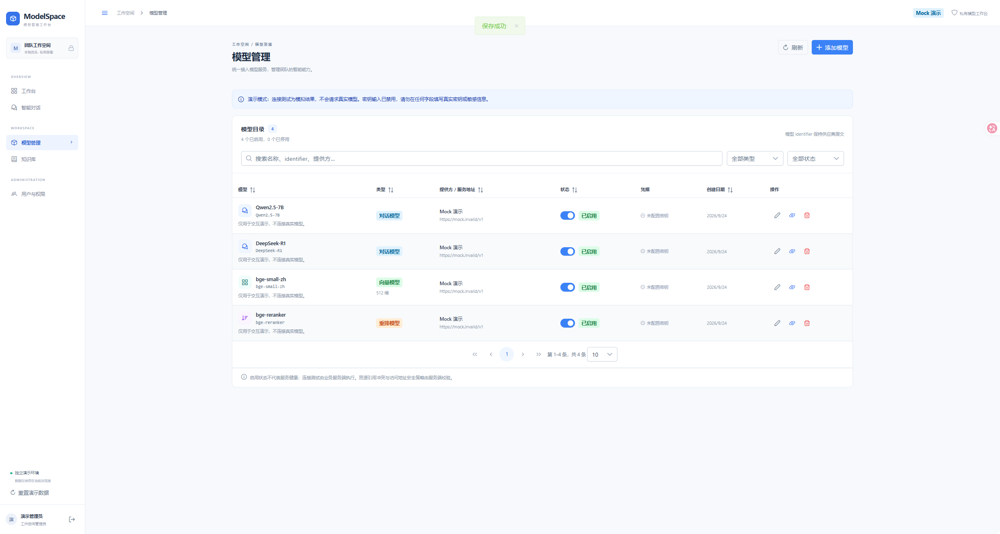
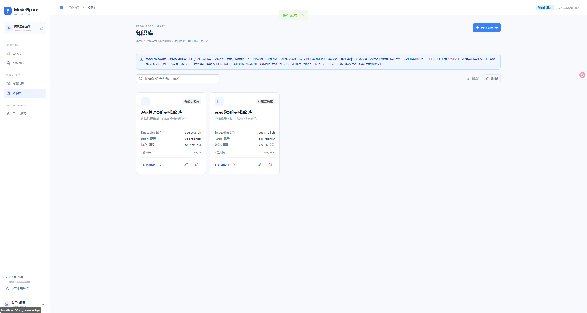

# ModelSpace · 模型管理工作台

面向百人以内的内网团队，提供模型接入与管理、用户与模型授权、知识库、文档处理与引用溯源、流式对话。当前包含 Vue 3 前端 + 本地 Python 检索服务（BGE Embedding），Mock 模式可完整体验，真实业务后端尚未接入。

## 项目结构

```
.
├── README.md                              # 本文件
├── 需求与架构分析规划.md                    # 全栈技术选型、RAG 流水线、部署与资源规划
├── 前端系统设计规划.md                      # 前端架构、Mermaid 图、API 契约、验收与边界
├── HuggingFace小型Embedding与知识库检索实施方案.md  # 检索能力专项实施文档
├── .gitignore
├── backend/                               # Python 本地检索服务
│   ├── app/                               # FastAPI 配置、模型、HTTP 路由
│   ├── tests/                             # pytest 单测（20 项）
│   ├── scripts/                           # 冒烟测试脚本
│   ├── run.py                             # 启动入口
│   ├── requirements.txt                   # 运行依赖
│   └── requirements-dev.txt               # 测试依赖
└── frontend/                              # Vue 3 前端
    ├── package.json
    ├── vite.config.ts
    ├── tsconfig.json
    ├── compose.yaml                       # Docker Compose 部署
    ├── Dockerfile
    ├── nginx.conf.template
    ├── .env.example
    ── src/
        ├── api/                           # 统一业务 API + 检索 HTTP 客户端
        ├── mock/                          # 演示适配器、种子数据、共享检索模块
        ├── types/                         # 实体、DTO、权限、SSE 事件、检索类型
        ├── stores/                        # Pinia 身份状态
        ├── router/                        # Vue Router + RBAC 守卫
        ├── utils/                         # SSE 解析、校验、错误处理、码点分片
        ├── layouts/                       # 工作台布局
        ├── views/                         # 登录 / 工作台 / 模型 / 用户 / 知识库 / 文档 / 对话
        ├── components/                    # KnowledgeRetrievalPanel 检索测试区
        ├── styles.css                     # 公共样式
        ├── main.ts
        └── App.vue
```

## 已实现能力

- 登录与 RBAC 路由守卫，固定 `admin` / `user` 两角色，权限变更实时生效。
- 模型管理（Chat / Embedding / Rerank），搜索、筛选、分页、CRUD、启停、连接测试；密钥不回显、不持久化。
- 用户管理，CRUD、启停、密码重置、多模型授权；禁止删除最后一个启用管理员。
- 知识库 CRUD，Embedding 必选、Rerank 可选；非空库禁止更换向量模型。
- 文档工作台，PDF / DOCX / MD / TXT 上传，独立上传进度与处理阶段进度，失败重试，切分参数预览与确认重处理，分页内容卡片。
- 流式对话，会话列表、模型与知识库配置、SSE 逐段输出、中止、引用详情鉴权与原文下载。
- 知识库检索测试区，本地 BGE Embedding 实际分片与语义检索，真实分数与命中排名，快照二次校验（身份/权限/版本/正文变化检测）。
- 模拟对话复用实际检索结果，引用卡片标注来源文档与片段版本；demo 模式保持离线固定引用。
- Mock 模式无需业务后端即可完整体验；检索服务独立运行（`127.0.0.1:8001`），经 Vite 同源代理转发。
- 真实模式通过 `VITE_DATA_MODE=rest` 切换业务数据，经同源 `/api/v1` 转发。
- 白色扁平主题，窄屏折叠导航；所有页面具备加载、空态、失败重试、提交中反馈。

## 界面预览

### 登录页



左侧品牌介绍，右侧账号密码登录表单，支持管理员与普通成员两种角色体验。

### 工作台



汇总可访问模型、知识库、文档总数、会话数等关键指标，展示模型资源分布与文档处理状态。

### 模型管理



统一模型目录，支持 Chat / Embedding / Rerank 三种类型，提供搜索、筛选、分页、CRUD、启停与连接测试。

### 知识库



知识库卡片列表，展示 Embedding 与 Rerank 配置、切分参数、文档数量，支持新建与打开知识库。

### 用户与权限



团队成员管理，支持角色分配、账号启停、多模型授权，禁止删除最后一个启用管理员。

### 智能对话



流式对话界面，左侧会话列表，右侧消息区支持模型与知识库配置、SSE 逐段输出、引用卡片溯源。

## 未实现范围

- 业务后端（Fastify / Prisma / BullMQ / Qdrant / Xinference）尚未接入，当前检索由本地 Python 服务提供。
- 真实 Chat 模型推理、PDF / DOCX 解析、Rerank 待联调。
- 自定义角色编辑器、共享知识库 ACL、消息分支、OCR、拖拽切分编排、服务端全文分页。

## 快速开始

环境要求：Node.js 22.12+（22 系列）或 24+；Python 3.11+。

```powershell
# 安装前端依赖
npm --prefix ./frontend ci --registry=https://registry.npmjs.org

# 启动前端开发服务（默认 Mock 模式，端口 5173）
npm --prefix ./frontend run dev
```

演示账号：`admin / admin123`，`member / member123`；新增演示用户统一使用 `demo123`。侧栏可重置演示数据。请勿上传敏感文件。

### 启动本地检索服务（可选）

知识库检索测试区和模拟对话引用需要本地 Python 检索服务：

```powershell
# 创建虚拟环境并安装依赖
python -m venv ./backend/.venv
& ./backend/.venv/Scripts/python.exe -m pip install -r ./backend/requirements.txt

# 启动检索服务（127.0.0.1:8001）
& ./backend/.venv/Scripts/python.exe ./backend/run.py
```

首次启动后在知识库详情页点击“加载模型”下载 BAAI/bge-small-zh-v1.5（约 90 MB），加载完成后即可进行实际语义检索。默认 `VITE_RETRIEVAL_MODE=local`；设为 `demo` 可跳过检索服务使用离线固定引用。

## 切换真实 API

复制 `frontend/.env.example` 为 `frontend/.env.local` 并修改：

```dotenv
VITE_DATA_MODE=rest
VITE_API_BASE_URL=/api/v1
API_PROXY_TARGET=http://localhost:3000
```

重启 Vite。真实模式后端不可达时显示错误，不降级演示。模型服务地址在模型管理表单配置，凭据由后端保存。

## 质量检查

```powershell
npm --prefix ./frontend run typecheck
npm --prefix ./frontend test
npm --prefix ./frontend run build
npm --prefix ./frontend run format:check
npm --prefix ./frontend audit --registry=https://registry.npmjs.org
```

当前 248 项 Vitest 测试通过（含 54 项检索模块测试、48 项检索 API 测试），后端 20 项 pytest 通过，依赖审计 0 个已知漏洞。Windows 下 Vitest 4 对路径大小写敏感，绝对路径请使用规范盘符 `C:\Users\X\Desktop\模型管理系统\frontend`。

## 容器部署

```powershell
docker compose -f ./frontend/compose.yaml up --build -d
```

默认发布到 8080。真实模式设置构建参数 `VITE_DATA_MODE=rest`，运行变量 `BACKEND_HOST`、`BACKEND_PORT` 指向业务后端。镜像不包含密钥，生产 HTTPS 由入口反向代理终止。

## 文档

- [需求与架构分析规划](./需求与架构分析规划.md)：全栈技术选型、RAG 流水线、部署与资源规划。
- [前端系统设计规划](./前端系统设计规划.md)：前端架构、Mermaid 图、API 契约、验收与边界。
- [HuggingFace Embedding 检索实施方案](./HuggingFace小型Embedding与知识库检索实施方案.md)：BGE 模型选型、本地检索服务、前端集成与实测数据。
- [Embedding 模型工作原理与检索闭环归档](./Embedding模型工作原理与检索闭环归档.md)：Embedding 原理、项目架构 Mermaid 图、完整检索流程。

## 许可证

私有项目，未公开授权。
