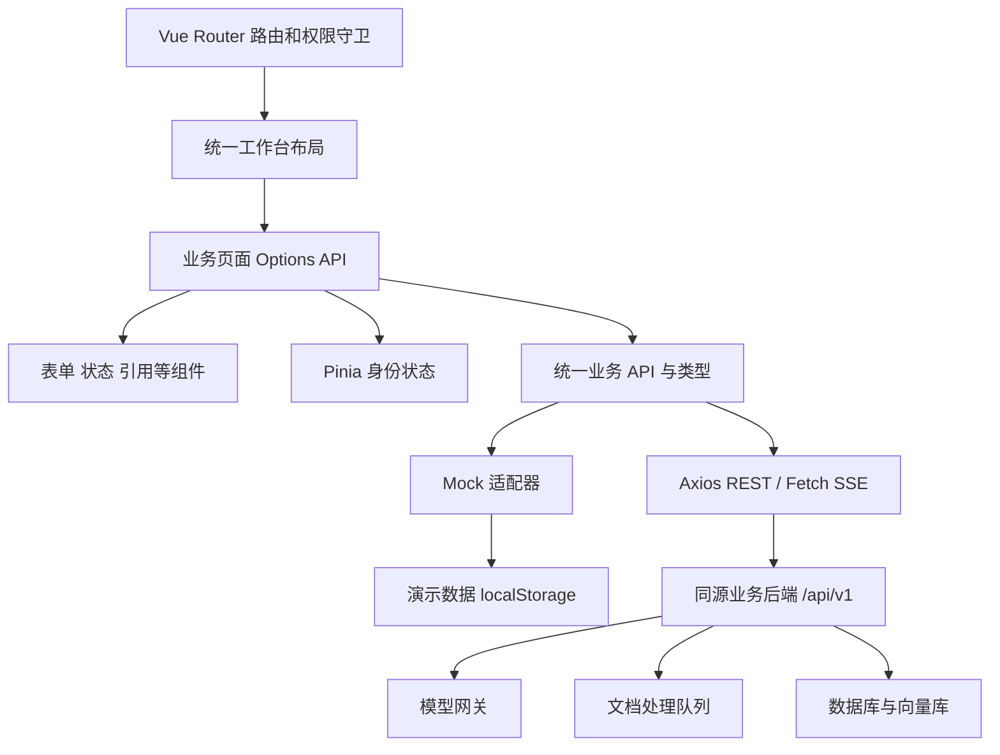
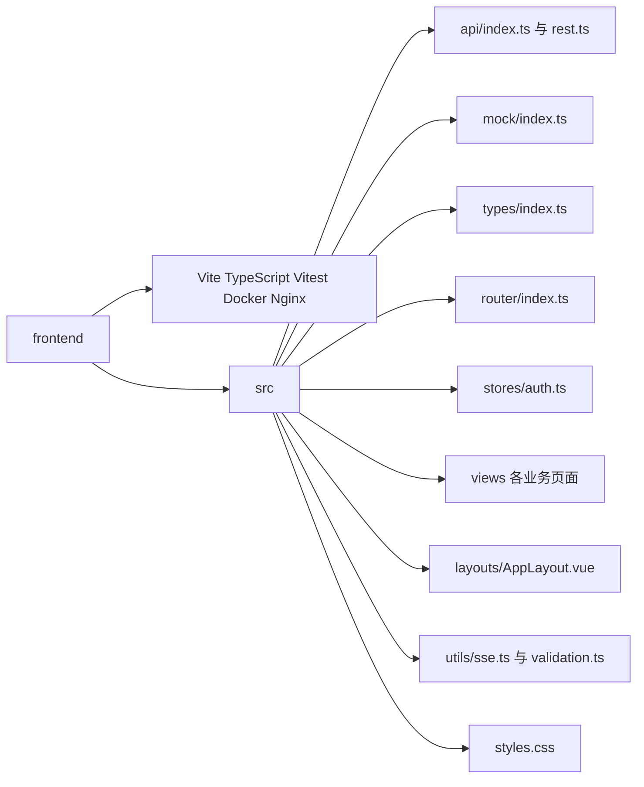
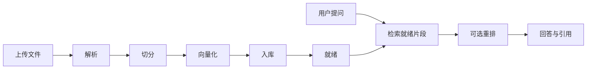
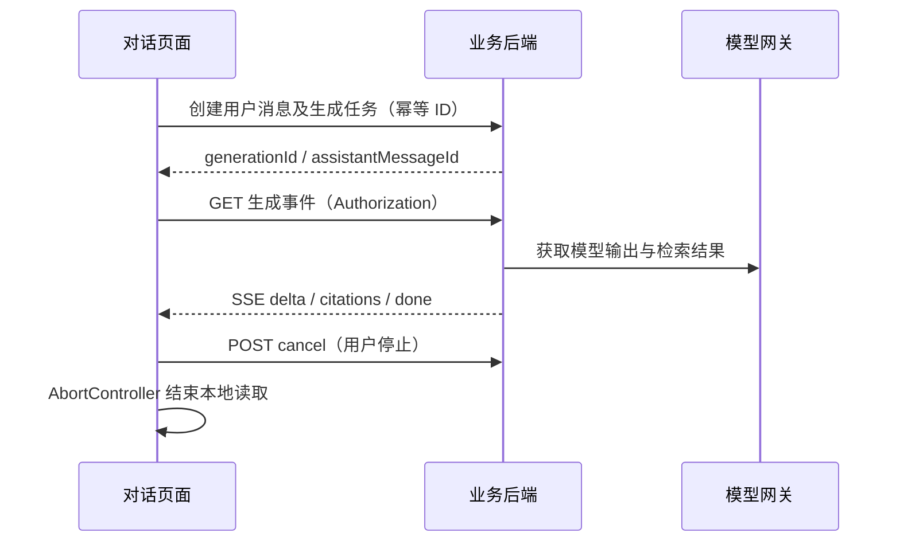

# 模型管理系统：前端设计、架构与实施规划

## 1. 需求分析与交付边界

面向百人以内的内网团队，提供模型接入与管理、用户与模型授权、对话、知识库、文档处理与引用溯源。当前只有需求文档，没有后端；交付完整可运行前端、独立 Mock 模式和真实 API 适配层，不将模拟解析、推理、向量化误报为真实能力。

已确认：统一管理工作台；Vue 3 Options API + TypeScript + Vite + Pinia + Vue Router + Axios；PrimeVue 免费 Aura 主题替代付费 Poseidon。图标使用与组件库配套、可本地打包的 PrimeIcons，作为原 Reicon 选型的实现调整。原文中的后端版本、性能数据及“唯一最优”等结论不作为前端正确性前提；前端只依赖业务契约。

## 2. 页面与视觉设计

白色扁平界面、浅灰背景、蓝色主操作、细边框；固定侧栏和顶部标题，窄屏折叠导航。不使用外部字体/CDN。每个页面提供加载、空态、失败重试、提交中反馈。

| 页面 | 内容 | 权限 |
| --- | --- | --- |
| 登录 | 账号密码、演示身份、模式提示 | 公开 |
| 工作台 | 模型/知识库/文档/会话统计、快捷入口 | 已登录 |
| 模型管理 | Chat/Embedding/Rerank、搜索、筛选、CRUD、启停、连接测试 | 管理员管理，用户只读授权模型 |
| 用户权限 | CRUD、角色、启停、模型授权 | 管理员 |
| 知识库 | CRUD、Embedding/Rerank、文档上传、处理进度、失败重试 | 本人资源，管理员治理 |
| 文档详情 | 参数、预览、重新处理、分页内容卡片、页码/章节 | 知识库可访问者 |
| 对话 | 会话增删改查、模型和知识库、SSE、停止、消息引用 | 本人会话 |
| 异常 | 403、404、接口失败 | 按场景 |

对话为会话列表、消息区、按需打开的引用抽屉；管理页采用工具栏、表格/卡片与表单弹窗。统计从当前授权业务数据计算，不虚构监控指标。

## 3. 前端架构



通过构建环境 `VITE_DATA_MODE=mock|rest` 选择适配器，不自动降级 Mock。演示数据带版本号并可重置，仅供非敏感测试；不保存真实密码或模型密钥。真实模式令牌只存内存，刷新会话依赖 HttpOnly Cookie，聊天与文档不写浏览器持久化。

### 代码结构



页面维护短期表单与加载状态；Pinia 维护共享身份；业务适配器集中处理请求和持久化；禁止在组件中直接调用模型供应商。DTO 统一 ID 字符串和 ISO 时间。拆分成领域页面，避免单文件应用。

## 4. 权限与安全边界

固定 admin/user 两角色。管理员管理全部模型和用户；普通用户仅使用已启用且获授权的模型。知识库默认本人可管理，管理员可治理；会话仅本人访问。前端守卫、菜单和模型选项提供体验控制，所有授权必须由真实后端再次校验。

模型凭据仅短暂留在编辑表单，通过 HTTPS 提交业务后端，随后清空；列表只返回 `hasApiKey`，绝不返回真实密钥。Mock 不保存密钥。后端负责加密、SSRF 防护与地址允许列表；连接测试也由后端发起。VITE 环境变量不得承载任何秘密。

禁止删除最后一个启用管理员；模型引用冲突由后端返回 409。非空知识库禁止更换 Embedding 模型，避免维度与既有索引不一致。页面用 Vue 文本转义展示模型回复及引用，不解析不可信 HTML，保留换行；首期不引入 Markdown HTML 渲染。登录限流、文件安全检测、资源归属和会话过期最终由后端落实。

## 5. 文档处理与引用



上传支持 PDF、DOCX、MD、TXT；单文件限制 20 MiB，后端仍须校验。上传百分比与处理阶段分开；页面轮询任务，离开时清理定时器。Mock 通过时间戳推进演示任务，明确 PDF/Word 为示例文本，向量化/入库为模拟，不请求真实模型。

默认切分 500 字符、重叠 50 字符；`50 <= chunkSize <= 4000`、`0 <= chunkOverlap < chunkSize`。字符切分不是 tokenizer 分词，真实后端按统一策略实现。预览显示正文、长度、序号、页码与章节；修改后显式重新处理，后端应新版本成功后原子替换旧版本。失败可重试。

引用随助手消息保存，包含文档 ID、名称、知识库 ID、片段 ID、版本、页码、章节、正文及相似度。无页码不伪造；分数不是答案准确率。引用抽屉通过 API 再次鉴权，支持原文下载；资源失效显示错误。

## 6. 对话流式状态



同一页面同一时刻生成一个回复；发送时快照模型和知识库配置。流式解析必须处理跨网络块、CRLF、UTF-8、多行 data、心跳及错误事件。网络 EOF 未收到 done 时显示中断，不假报成功，不自动重复提交。停止应同时取消后端任务与本地读取，取消失败明确反馈。离开页面停止订阅，重新进入重新获取消息状态。

## 7. API 契约（待后端实现）

所有 REST 成功响应为 `{ data: T }`，错误为 `{ error: { code, message } }`，保留 HTTP 401/403/409/413/415/422/429/5xx。当前百人规模的管理列表返回已授权数组，前端搜索分页；后续大规模扩展应增加服务器分页。文档 chunks 返回完整数组用于当前版本预览，生产大文档必须由后端限制片段数并迭代分页接口。

| 接口 | 请求/返回 |
| --- | --- |
| POST /auth/login | username/password → user/accessToken |
| POST /auth/refresh | HttpOnly Cookie → user/accessToken |
| POST /auth/logout | 撤销刷新凭据 |
| GET /models | Model[]，始终脱敏 |
| POST /models、PATCH/DELETE /models/:id | ModelInput → Model；删除返回 null |
| POST /models/:id/test-connection | message/latency |
| GET /users；POST /users；PATCH/DELETE /users/:id | User / UserInput（含 modelIds） |
| GET /knowledge-bases；POST /knowledge-bases；PATCH/DELETE /knowledge-bases/:id | KnowledgeBase / KnowledgeInput |
| GET/POST /knowledge-bases/:id/documents | Document[] / multipart file 上传返回 Document |
| GET/DELETE /documents/:id | 文档详情 / 删除 |
| GET /documents/:id/chunks | Chunk[] |
| POST /documents/:id/chunk-preview | chunkSize/chunkOverlap → Chunk[] |
| POST /documents/:id/process | chunkSize/chunkOverlap → Document（202） |
| GET /documents/:id/download | 鉴权原文件 Blob |
| GET/POST /conversations；PATCH/DELETE /conversations/:id | Conversation，创建或修改 title/modelId/knowledgeBaseIds |
| GET /conversations/:id/messages | Message[] |
| POST /conversations/:id/messages | content/clientRequestId → generationId/assistantMessageId |
| GET /generations/:id/events | SSE（meta/delta/citations/done/error） |
| POST /generations/:id/cancel | 取消生成 |
| GET /messages/:id/citations/:citationId | Citation，再次校验源文档权限 |

SSE 数据分别为 `delta: {text}`、`citations: {citations: Citation[]}`、`done: {}`、`error: {message}`；事件可含 id 用于当前连接去重。事件接口应从生成起点重放，前端首个增量替换历史快照，避免重复拼接；收到 done 立即释放连接，不依赖后端断开。刷新凭据采用后端 HttpOnly/Secure/SameSite Cookie；后端校验 Origin/CSRF。REST 401 合并刷新后重试一次；SSE 建连前确保身份，失败保留已接收文本并提示。

精确字段以 `frontend/src/types/index.ts` 和 `frontend/src/api/rest.ts` 为准。Mock 和真实模式共用 API 接口。

## 8. 实施与验收

先交付本规划，然后创建项目基础、认证与管理页面、知识库处理页面、对话与引用，再进行类型检查、生产构建、单元测试与浏览器完整流程验证。

测试覆盖切分边界、文件校验、SSE 分帧、RBAC、CRUD 冲突、知识库处理和对话取消。浏览器验证管理员/普通用户、窄屏、页面刷新、模型创建、知识库上传与引用。真实 API 传输通过可控响应测试，实际模型服务联调依赖后端，不宣称已验证。

部署采用 Vite 开发代理和 Nginx 同源代理。Nginx SPA 回退不应用于 /api；SSE 关闭缓冲，上传限制一致。Docker 多阶段构建，Mock 镜像不依赖后端启动，真实模式显式配置后端代理地址。生产必须使用 HTTPS。

## 9. 项目运行与交付说明

### 本地运行

环境：Node.js 22.12+（22 系列）或 Node.js 24+；本次使用 Node.js 24.14。依赖锁定在 `frontend/package-lock.json`，后续使用 `npm ci` 复现。

在项目根目录执行：

```powershell
npm --prefix ./frontend ci --registry=https://registry.npmjs.org
npm --prefix ./frontend run dev
```

开发服务默认端口 5173。默认即 Mock 模式，无需后端。管理员 `admin / admin123`，普通成员 `member / member123`；也可在登录页点击身份体验按钮。新增演示用户统一使用 `demo123`，不会保存表单密码，重置密码操作仅演示请求流程。所有演示口令都不适用于生产。

演示数据存储约束为 2 MiB，避免小型演示占满浏览器配额；容量不足会报错而非假成功。侧栏可重置演示数据。删除测试资源只影响当前浏览器；请勿上传敏感文件。

### 切换真实 API

将 `frontend/.env.example` 复制为 `frontend/.env.local`，修改：

```dotenv
VITE_DATA_MODE=rest
VITE_API_BASE_URL=/api/v1
API_PROXY_TARGET=http://localhost:3000
```

重启 Vite。真实模式后端不可达时显示错误，不降级演示。浏览器只访问同源 `/api/v1`；`API_PROXY_TARGET` 是业务后端，不是模型 API。模型服务地址在模型管理表单配置，凭据由后端保存。构建时切换模式需要重新构建，不能仅修改已打包的静态文件环境变量。

### 质量检查

```powershell
npm --prefix ./frontend run typecheck
npm --prefix ./frontend test
npm --prefix ./frontend run build
npm --prefix ./frontend run format:check
npm --prefix ./frontend audit --registry=https://registry.npmjs.org
```

Windows 的 Vitest 4 对路径大小写敏感；本次验证绝对路径时使用规范盘符 `C:\Users\X\Desktop\模型管理系统\frontend`。小写 `c:` 启动可能触发 runner 重复加载，不代表业务测试失败。

构建输出 `frontend/dist`，可通过 `npm --prefix ./frontend run preview` 检查生产静态产物。开发服务不是生产服务器。

### 容器部署

```powershell
docker compose -f ./frontend/compose.yaml up --build -d
```

默认发布到 8080。真实模式设置构建参数 `VITE_DATA_MODE=rest`，运行变量 `BACKEND_HOST`、`BACKEND_PORT` 指向业务后端。默认代理宿主机 3000 端口；与后端同 Compose 网络时可设 `BACKEND_HOST=backend`。镜像不包含密钥，生产 HTTPS 可由入口反向代理终止。

### 当前验收结果与剩余边界

- TypeScript 检查及生产构建通过；146 项 Vitest 测试通过，包括 49 项 Mock、89 项 REST/SSE 适配和 8 项流式/校验测试。
- 升级测试依赖后 `npm audit` 为 0 个已知漏洞。
- 浏览器已实际验证：管理员/成员登录退出、模型和用户增删改、模拟连接测试、TXT 上传、切分预览及重处理、关联知识库对话、引用访问、中止后再次发送、成员直达管理路由的 403。
- 窄屏工作台 DOM 尺寸检查未见页面横向溢出；完整窄屏截图与移动端对话补验因浏览器面板不可用未完成。已有工作台与对话截图在项目根目录 `browser-test-*.png`；这些截图不代替移动设备测试。
- Compose 配置校验通过；当前 Docker daemon 未启动，未实际构建或运行容器。
- 没有真实后端，故真实登录、模型推理、PDF/DOCX 解析、向量化及检索效果尚未端到端联调。REST 测试使用可控响应，不表示服务已存在。
- 当前使用纯文本安全展示模型输出，不渲染 HTML；首期不包含自定义角色编辑、共享知识库 ACL、消息分支、OCR、拖拽切分工作流编排、服务端全文分页。这些不是静态按钮占位，而是明确不在此次前端实现范围内。

